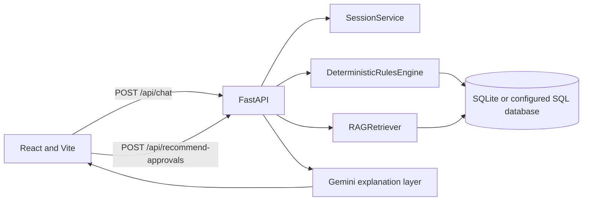
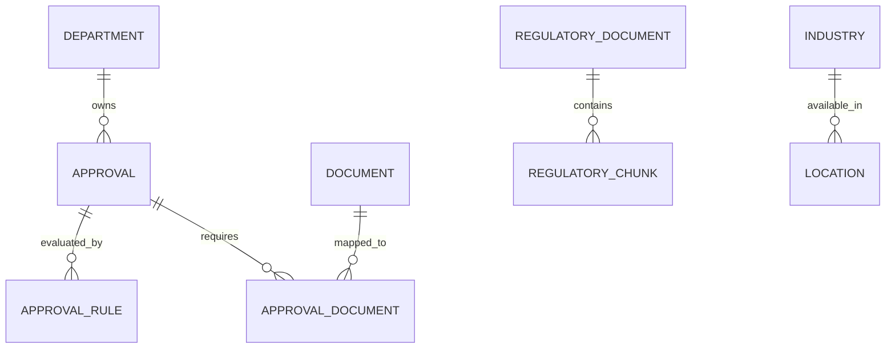

# Samanvay system design

## Architecture

The browser sends text to `/api/chat`. `SessionService` extracts profile fields and holds conversation profiles in process memory. The frontend then sends the structured profile to `/api/recommend-approvals`. `DeterministicRulesEngine` evaluates active approval records and applicability rules, calculates missing documents and staleness, and returns structured data. The route retrieves related regulatory chunks and passes both the deterministic result and retrieved documents to `GeminiExplanationService`. Gemini only phrases those inputs; if the API key is absent or the call fails, the deterministic formatter is used. The structured result remains in the HTTP response for UI rendering.

## Data model

SQLAlchemy models live under `backend/app/models`; the initial Alembic migration is under `backend/alembic/versions`. Seed data is explicitly marked DEMO. `ApprovalRule.conditions` stores optional JSON conditions such as allowed pollution categories and project stages. The rules engine uses those conditions as well as the typed rule columns.

## API

| Method | Path | Purpose |
| --- | --- | --- |
| GET | `/` | Service status and disclaimer |
| GET | `/api/health` | Health check |
| POST | `/api/chat` | Extract profile, maintain in-memory session, ask for missing fields |
| POST | `/api/business-profile` | Create or update a profile |
| GET | `/api/business-profile/{session_id}` | Read a profile |
| POST | `/api/recommend-approvals` | Deterministic matching plus explanation and retrieved context |
| GET | `/api/approvals/{approval_id}` | Read a verified registry record |
| GET | `/api/industries`, `/api/locations`, `/api/departments` | Read master data |
| POST | `/api/documents` | Read document records |
| POST | `/api/search-regulations` | Keyword search of regulatory records; JSON body `{ "query": "..." }` |
| POST | `/api/rag/query` | Retrieve similar regulatory clauses with source and verification dates |

## RAG and source grounding

`seeds/demo_rag_docs.py` provides demo regulatory documents. `TextChunker` divides their extracted text, `EmbeddingService` stores Gemini embeddings when configured and otherwise deterministic fallback vectors, and `RAGRetriever` ranks chunks by cosine similarity while reporting source URLs and `last_verified`. The seed runner invokes this seed function so one seed command initializes both approvals and RAG. These records are demo content and require authoritative review before real regulatory use.

## Safety and limitations

Approval matching is plain Python and determines which structured records are returned. Gemini cannot add approval names, fees, timelines, or legal requirements: its prompt limits explanation to those records and retrieved clauses. An approval without rules is returned as **Information required**, rather than assumed to apply. Potentially stale records are flagged using `REGULATORY_STALENESS_DAYS`. Chat profiles are held in memory and do not persist across server restarts or multiple workers. This prototype is Maharashtra-specific and provides preliminary guidance, not a government determination.
